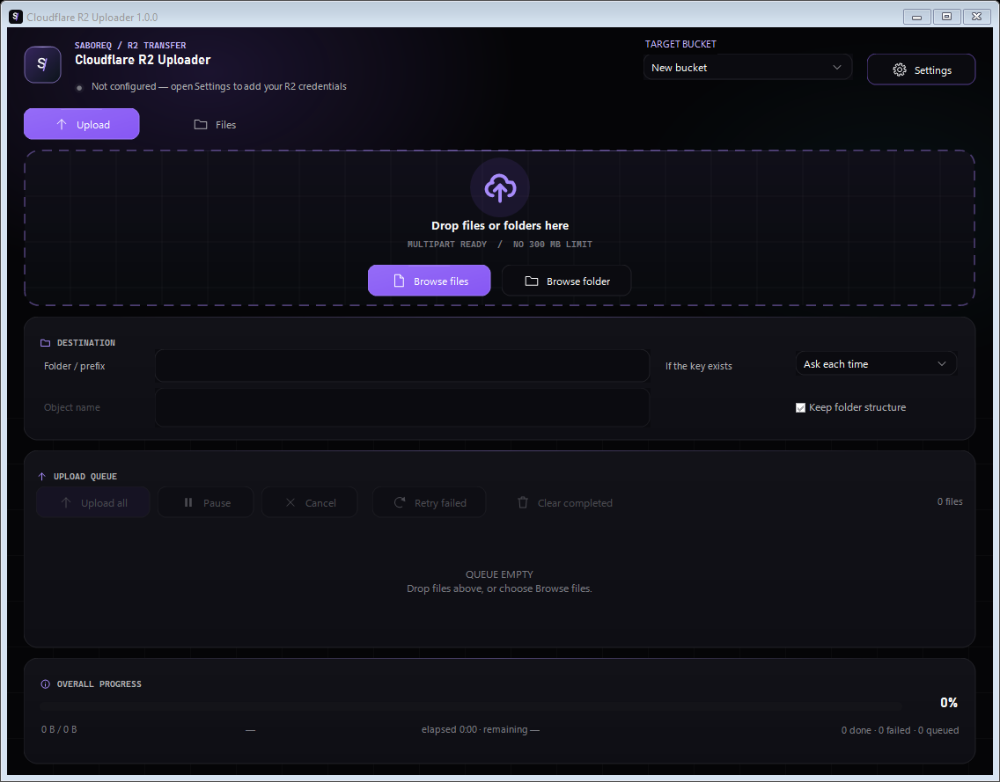

# Cloudflare R2 Uploader

[](https://github.com/Saboreq/CloudflareR2Uploader/actions/workflows/ci.yml)
[](https://github.com/Saboreq/CloudflareR2Uploader/releases)

Cloudflare R2 Uploader is a Windows desktop client for uploading, browsing, previewing, downloading, and managing objects through Cloudflare R2's S3-compatible API. It keeps credentials protected with Windows DPAPI and supports resumable multipart uploads without a Worker, mounted drive, or background service.



## Highlights

- Multiple bucket profiles with separate DPAPI-protected credentials.
- Single-part and bounded parallel multipart uploads with pause, resume, cancel, retry, overwrite policies, and post-upload verification.
- Paginated object browser with virtual-folder navigation, multi-selection, current-page filtering, stable typed sorting, and keyboard shortcuts.
- Preflighted bulk downloads and permanent bulk deletion for mixed file/folder selections, including overlap deduplication and cancellation.
- Public URL copying, temporary SigV4 download links, rich local Preview, and complete Properties metadata.
- Tray-owned background lifetime, close/minimize-to-tray, per-user Start with Windows, and single-instance activation.
- Per-user installer and consent-based HTTPS updates authenticated with RSA-PSS/SHA-256, then verified by exact size and SHA-256.

## Supported Windows and requirements

- Windows 10 or Windows 11.
- Microsoft .NET 10 Desktop Runtime (x64). The installer checks this prerequisite before changing the installation.
- A Cloudflare account, R2 bucket, and bucket-scoped R2 S3 credentials.
- Microsoft Edge WebView2 Evergreen Runtime for PDF/rich WebView2 previews. WebView2 is optional for uploads, browsing, text/image previews, and Properties; the application remains usable when the runtime is absent.

## Install

Download `CloudflareR2Uploader-v<VERSION>-Setup.exe` from [GitHub Releases](https://github.com/Saboreq/CloudflareR2Uploader/releases) and run it. The Inno Setup wizard installs the application for the current Windows account under `%LocalAppData%\Programs\CloudflareR2Uploader`, creates a desktop shortcut by default, adds Start menu and Windows Apps uninstall entries, handles in-use application files during upgrades, and can open the app when finished.

Administrator rights are not required. Application settings, protected credentials, logs, caches, and resumable state remain outside the install directory, so upgrading or uninstalling binaries does not overwrite user data.

## Create Cloudflare R2 credentials

1. Open Cloudflare Dashboard, select **R2 object storage**, and create or select a bucket.
2. Open **Manage R2 API Tokens** and create bucket-scoped S3 credentials.
3. Grant Object Read for browsing, downloading, metadata, previews, overwrite checks, resume, and verification. Grant Object Write for uploads, folders, copy/move/rename, overwrite, and deletion.
4. Copy the generated Access Key ID and Secret Access Key when Cloudflare displays them. These differ from a normal dashboard API token.
5. Copy the Account ID from the R2 or account overview.

In Settings, add a bucket profile, enter its account, bucket, and credentials, optionally set a custom HTTPS endpoint and PublicBaseUrl, then test and save. The bucket selector switches profiles without rebuilding the queue. Credentials never enter `settings.json`.

## Uploads and multipart resume

Drop files or folders onto Upload, or use **Browse files** and **Browse folder**. Choose a destination prefix, folder-structure behavior, and overwrite policy. Smaller files stream through one PUT; larger files use bounded parallel multipart requests. Confirmed part ETags are stored under local upload state so compatible uploads can resume after cancellation or restart.

Pause stops scheduling new work while in-flight parts finish. Cancellation can keep resumable parts or abort them. R2 folders are key prefixes, not real directories.

## Browse, select, filter, and sort

Open **Files** to list up to 250 rows per server page. Previous/Next use R2 continuation tokens. Double-click opens a folder only when exactly one folder is selected.

Use Ctrl/Shift selection or Ctrl+A. Right-click follows Explorer selection conventions. The filter searches only the loaded page by name, key/prefix, type, and extension; it does not issue a request per keystroke. Column headers sort the loaded page on typed name, type, size, or modified values, always keeping folders first. Sort and details layout persist, while filter text does not.

Useful shortcuts include Delete, Ctrl+C for keys, Ctrl+Shift+C for public URLs, Ctrl+D to download, Ctrl+F to filter, Escape to clear the filter/selection, Enter to open one folder, F5 to refresh, and Backspace for the parent prefix.

## Bulk downloads and deletion

Bulk and folder downloads recursively enumerate selected prefixes before confirmation, follow every continuation token, deduplicate overlaps, calculate known totals, and map keys to safe Windows paths. Downloads use three workers, stream to `.r2partial`, verify known lengths, then rename into place. Conflicts can be overwritten, skipped, or deterministically renamed while preserving extensions.

Bulk deletion performs the same recursive preflight and reports the visible row count separately from the unique R2 objects affected. Delete is permanent; there is no Trash. Folder rename/move and other prefix operations can copy many objects before deleting originals.

## Public and temporary URLs

Public URLs are constructed locally from the profile's PublicBaseUrl and encoded object key. Configuring PublicBaseUrl does not make a private bucket or object public. Folder selections are ignored because prefixes do not have public object URLs.

Temporary download links are HTTPS SigV4 GET bearer tokens generated locally for 15 minutes through seven days. Anyone holding a link can access the object until expiry. Links are not saved, logged, or added to history.

## Preview and Properties

The details area has Preview and Properties tabs and can be hidden. Selection changes are debounced and stale async results are rejected.

Text, JSON, XML, CSV, Markdown, source/config/log files, common images, and PDF are supported within bounded limits. JSON is pretty-printed; XML disables DTD and external entities. HTML and SVG are shown as source and never executed. Preview data downloads through the authenticated SDK to a randomized session directory; WebView2 never navigates to signed or public R2 URLs and blocks remote navigation/popups. Very large objects are not previewed.

Properties shows standard object headers, ETag, timestamps, endpoint/profile context, sorted custom metadata, optional extracted image metadata, and link actions. Folder properties deliberately avoid inventing size, modified time, or object counts.

## Tray, background operation, and startup

Closing the window hides it by default; it does not exit or dispose the upload queue. Minimize-to-tray is also enabled by default. Use the tray icon to open/hide the app, view upload status, upload, pause/resume, open Files or Settings, open logs, toggle Start with Windows, or **Exit**. Exit performs the real teardown and prompts about active multipart uploads. Aggregate notifications avoid exposing object names.

Start with Windows writes only this quoted command under the current user's Run key and needs no administrator rights:

```text
"C:\path\to\CloudflareR2Uploader.exe" --background
```

A per-user named mutex and pipe ensure a second launch activates the existing window. `--show` requests the normal UI; unknown arguments are ignored safely.

## Updates

Installer builds can contain a publisher-configured HTTPS manifest URL and trusted RSA public key. The application rejects unsigned, malformed, altered, or wrong-key manifests before comparing versions or starting an installer request. When automatic checks are enabled, the app checks once after startup and shows a notification when a higher SemVer release exists. The Updates settings page shows the version, size, and release notes. **Download and install** retrieves the setup EXE, re-authenticates the manifest, verifies the declared byte length and SHA-256, asks for final consent, preserves or discards active multipart state according to the user's choice, then reopens and verifies the exact installer while denying replacement through process launch before restarting the app.

Updates are never installed silently. Automatic checks can be disabled in Settings, and **Check for updates...** is available from the tray menu. See [deploy/README.md](deploy/README.md) for the dedicated Cloudflare R2 bucket, custom-domain, immutable installer, and manifest-last publishing setup.

## Local data and security

Runtime data stays under `%LocalAppData%\CloudflareR2Uploader\`:

- `settings.json`: non-secret preferences and profiles.
- `credentials.bin`: optional current-user DPAPI-protected credentials.
- `UploadState\`: resumable multipart state without credentials.
- `Logs\`: sanitized diagnostics.
- `PreviewCache\`: bounded temporary object copies, cleaned best-effort on exit/startup.
- `WebView2\`: dedicated browser user data.
- `Updates\`: verified setup downloads, pruned automatically.

Preview cache content can contain private object data. Protect the Windows account and disk accordingly. Credentials, authorization headers, signed URL query strings, and preview contents are excluded from normal logs and release packages.

## Build, test, and package locally

Install the .NET 10 SDK with Windows desktop targeting. Use Visual Studio 2026 (18.0+) with the .NET desktop development workload, or the .NET 10 CLI with an editor such as VS Code. The release/package path additionally requires PowerShell 7+ and the official Inno Setup 6.7.1 installation. `CloudflareR2Uploader.sln` is the only supported solution and all projects are SDK-style. If Inno Setup was installed in a custom directory, pass its registered compiler with `-InnoSetupCompiler <path-to-ISCC.exe>`; the path must match the official 6.7.1 uninstall registration and is validated before build or package child processes start.

Run the build and tests directly with:

```powershell
dotnet restore .\CloudflareR2Uploader.sln
dotnet build .\CloudflareR2Uploader.sln -c Debug --no-restore
dotnet test .\CloudflareR2Uploader.sln -c Debug --no-build
```

The supported repository layout is:

- `src/CloudflareR2Uploader.Core`: models, persistence, formatters, and application contracts.
- `src/CloudflareR2Uploader.Infrastructure.R2`: Cloudflare R2/S3 operations and transfer services.
- `src/CloudflareR2Uploader.Platform.Windows`: DPAPI, startup, single-instance, theme, and update integration.
- `src/CloudflareR2Uploader.Wpf`: the only desktop frontend.
- `tools/CloudflareR2Uploader.UpdateSigner`: the shared signed-manifest publisher/verifier CLI.
- `tests/`: the five .NET 10 MSTest projects plus the PowerShell 7 release-security harness.

Run the complete restore, Release build, MSTest suite, framework-dependent x64 WPF publish, payload validation, and single-EXE installer build through `build/Build-Release.ps1`:

```powershell
.\build\Build-Release.ps1 -Version 1.2.3
```

Options include `-SkipTests`, `-Configuration Debug|Release`, `-OutputDirectory <path>`, `-KeepStaging`, `-UpdateBaseUrl <https-url>`, `-UpdateManifestPublicKey <base64-spki>`, `-UpdatePrefix <path>`, and `-InnoSetupCompiler <path>`. The update URL and public key must be supplied together. Test results are written as TRX under `TestResults`. The only release file is the Inno installer `CloudflareR2Uploader-v<VERSION>-Setup.exe`.

For an update-enabled production build, use the same public base URL and prefix that will be published to R2:

```powershell
.\build\Build-Release.ps1 -Version 1.2.3 -UpdateBaseUrl https://downloads.example.com -UpdateManifestPublicKey <base64-spki>
```

## GitHub automation and publishing

`.github/workflows/ci.yml` runs the complete Windows build/test/package path and the PowerShell release-security harness for main pushes, pull requests, and manual runs without R2 credentials. `.github/workflows/release.yml` validates tags, requires the paired `UPDATE_BASE_URL` and `UPDATE_MANIFEST_PUBLIC_KEY` repository variables, runs the same gates, preserves prerelease informational versions, and creates a GitHub Release using only the repository-provided token.

Publish a reviewed release with:

```powershell
git tag v1.2.3
git push origin v1.2.3
```

See [docs/RELEASING.md](docs/RELEASING.md) for release verification and failure handling.

## Troubleshooting and known limits

- **Not configured:** add and test a bucket profile with complete R2 S3 credentials.
- **PDF preview unavailable:** install WebView2 Evergreen Runtime; other app features continue working.
- **Access denied:** add Object Read and/or Object Write permission required by the attempted operation.
- **Startup path stale:** open Settings and save with Start with Windows enabled.
- **Updates not configured:** build with both `-UpdateBaseUrl` and `-UpdateManifestPublicKey`, or use the Cloudflare publisher script so setup embeds the authenticated update source.
- Filters and sorting affect only the current server page. There is no drive mounting, WebDAV, Trash, version browser, or server-side full-bucket search.
- Live R2 behavior depends on the user's endpoint, credentials, permissions, object sizes, and network. CI uses no real credentials and performs no Cloudflare integration calls.

## Contributing, security, components, and license

Read [CONTRIBUTING.md](CONTRIBUTING.md) before changing the application. Report vulnerabilities as described in [SECURITY.md](SECURITY.md). Direct dependencies and licenses are listed in [THIRD-PARTY-NOTICES.md](THIRD-PARTY-NOTICES.md).

Cloudflare R2 Uploader is licensed under the [MIT License](LICENSE), copyright (c) 2026 Saboreq. Third-party components retain their own licenses.
